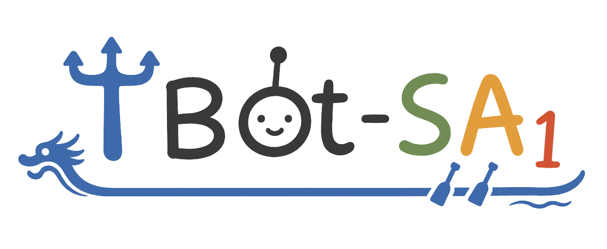
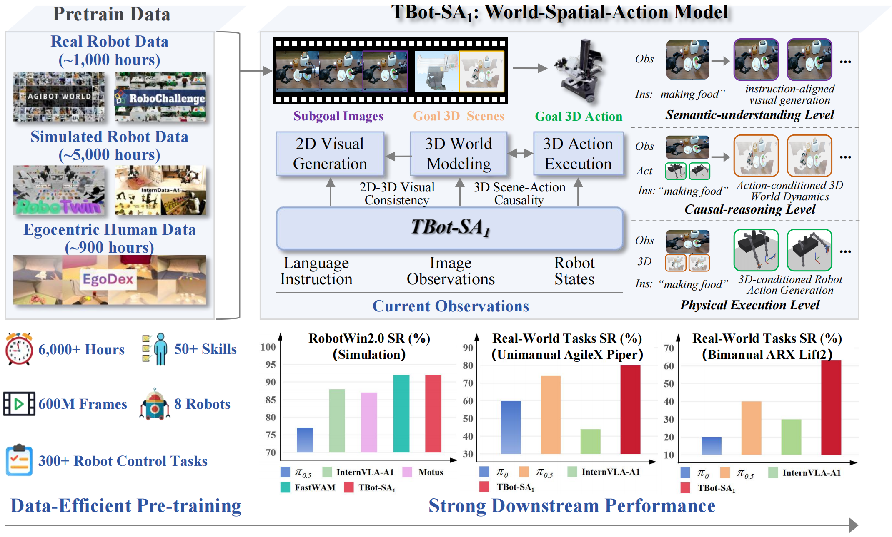
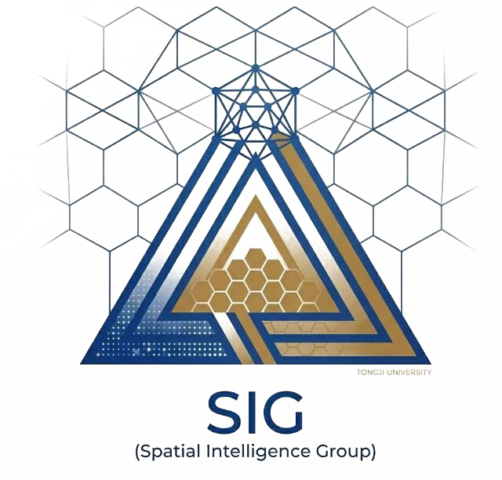

<p align="center">
  
</p>

<h3 align="center">TBot-SA<sub>1</sub>: 2D-3D Latent World Action Modeling for Generalizable Robot Control</h3>

<p align="center">
  a <strong>World-Spatial-Action</strong> embodied
  foundation model that unifies instruction-aligned 2D visual planning,
  action-conditioned 3D world modeling, and 3D-aware action generation.
</p>

<p align="center">
  <a href="https://zaleni.github.io/TBot-SA1/">
    
  </a>
  <a href="https://github.com/zaleni/TBot-SA1">
    
  </a>
  <a href="https://github.com/zaleni/TBot-SA1/blob/main/assets/WSA.pdf">
    
  </a>
  <a href="https://huggingface.co/collections/zaleni/tbot-sa1">
    
  </a>
  <a href="https://robochallenge.ai/competition/cvpr">
    
  </a>
</p>

<p align="center">
  
</p>

<a id="news"></a>

## 🗞️ News

- [2026-05-18]: 🏆 Our fully open-source WSA model **TBot-SA1 ranked 4th worldwide and 1st among university
  teams on the [RoboChallenge CVPR leaderboard](https://robochallenge.ai/competition/cvpr).** (Team: MagicBot)
- [2026-05-31]: 🎉 Release of TBot-SA1 training, evaluation, and inference code.
- [2026-05-31]: 🤗 Released the WSA paper and the TBot-SA1 Hugging Face
  model collection with Base, RoboTwin, and LIBERO models.

<a id="todo-list"></a>

## TODO List

- [x] Provide RoboTwin, LIBERO, and real world robot example inference workflows.
- [x] Release TBot-SA1 policy code and finetuning scripts.
- [x] Release TBot-SA1 pretraining scripts.
- [ ] Release paper on arxiv and citation.
- [ ] Release results and models on more benchmarks.
- [ ] **[Coming soon] Release TBot-SA1-Wan model code, a 6B type of WSA model using Wan2.2 video model as backbone.**
- [ ] **Release TBot-SA1-Wan model weights and results.**

## Table of Contents

- [News](#news)
- [TODO List](#todo-list)
- [Overview](#overview)
- [Repository Layout](#repository-layout)
- [Installation](#installation)
- [Model Zoo](#model-zoo)
- [RoboTwin Evaluation](#robotwin-evaluation)
- [Training](#training)
- [Inference Examples](#inference-examples)
- [Acknowledgments](#acknowledgments)

## Overview

<p align="center">
  
</p>

TBot-SA1 is a World-Spatial-Action (WSA) embodied foundation model for
generalizable robot control. It learns a shared 2D-3D latent space that connects
instruction-aligned visual planning, action-conditioned 3D world prediction,
and 3D-aware action generation.

Method Highlights:

- WSA modeling unifies semantic understanding, 3D world modeling, and physical
  execution.
- Bidirectional 3D causality learns both action-conditioned scene dynamics and
  3D inverse dynamics.
- Mixture-of-Transformers coordinates 2D planning, 3D prediction, and 3D action
  generation with shared dependency rules.
- Data-efficient pretraining on 6,000 demonstration hours yields strong
  simulation and real-world manipulation performance.

## Repository Layout

```text
assets/                  README figures and paper assets
configs/                 data sampling and weight-rule configs
evaluation/
  RoboTwin/              RoboTwin evaluation entrypoints
  Libero/                LIBERO evaluation and websocket serving helpers
  Real_Piper_Example/    Piper real-robot serving/client example
  Real_Lift2_Example/    Lift2 real-robot serving/client example
launch/
  tbot_sa1_*.sh          TBot-SA1 pretraining and finetuning scripts
  supported_methods/     RoboTwin finetuning scripts for comparison methods
src/lerobot/             LeRobot-based training, dataset, and policy code
third_party/             Git submodules for external projects
tools/                   support scripts used by training workflows
```

## Installation

The main development environment is tested with Python 3.10, CUDA 12.8, and
PyTorch 2.7.1.

```bash
git clone --recurse-submodules https://github.com/zaleni/TBot-SA1.git
cd TBot-SA1
git submodule update --init --recursive

conda create -y -n tbot_sa1 python=3.10
conda activate tbot_sa1
pip install --upgrade pip

conda install -c conda-forge ffmpeg=7.1.1 svt-av1 -y

pip install torch==2.7.1 torchvision==0.22.1 torchaudio==2.7.1 \
  --index-url https://download.pytorch.org/whl/cu128

pip install torchcodec numpy scipy transformers==4.57.1 mediapy loguru pytest omegaconf h5py
pip install -e .
```

For real-robot serving and websocket evaluation:

```bash
pip install tyro matplotlib mediapy websockets msgpack
```

For RoboTwin, also install the evaluator requirements and follow the upstream
RoboTwin asset setup:

```bash
pip install -r evaluation/RoboTwin/requirements.txt
```

TBot-SA1 uses a patched Qwen3-VL implementation for cached inference. After
installing `transformers==4.57.1`, copy the replacement model files into the
installed package:

```bash
TRANSFORMERS_DIR=${CONDA_PREFIX}/lib/python3.10/site-packages/transformers/
cp -r src/lerobot/policies/TBot_SA1/transformers_replace/models ${TRANSFORMERS_DIR}
```

## Model Zoo

| Name | Type | Usage |
| --- | --- | --- |
| [TBot-SA1-Base](https://huggingface.co/zaleni/TBot-SA1-Base) | Base policy model | General initialization and downstream finetuning |
| [TBot-SA1-RoboTwin](https://huggingface.co/zaleni/TBot-SA1-RoboTwin) | RoboTwin policy model | RoboTwin evaluation and finetuning initialization |
| [TBot-SA1-LIBERO](https://huggingface.co/zaleni/TBot-SA1-LIBERO) | LIBERO policy model | LIBERO evaluation and finetuning initialization |
| `Qwen/Qwen3-VL-2B-Instruct` | VLM backbone and processor | `QWEN3_VL_PRETRAINED_PATH`, `QWEN3_VL_PROCESSOR_PATH` |
| `nvidia/Cosmos-Tokenizer-CI8x8` | Cosmos tokenizer | `COSMOS_TOKENIZER_PATH_OR_NAME` |
| `depth-anything/DA3-LARGE-1.1` | 3D teacher | Training or evaluation with the 3D teacher enabled |

All released models are available in the
[TBot-SA1 Hugging Face collection](https://huggingface.co/collections/zaleni/tbot-sa1).
For RoboTwin evaluation, load the released RoboTwin model:

```bash
PRETRAINED_CKPT=zaleni/TBot-SA1-RoboTwin
```

For standard RoboTwin action evaluation with the released model, use
`DISABLE_DA3_TEACHER_FOR_EVAL=true`.

## RoboTwin Evaluation

The maintained TBot-SA1 RoboTwin entrypoint is
`evaluation/RoboTwin/eval_randomized_50.sh`. See
[evaluation/RoboTwin/README.md](evaluation/RoboTwin/README.md) for all runtime
options.

```bash
PRETRAINED_CKPT=zaleni/TBot-SA1-RoboTwin \
QWEN3_VL_PRETRAINED_PATH=Qwen/Qwen3-VL-2B-Instruct \
QWEN3_VL_PROCESSOR_PATH=Qwen/Qwen3-VL-2B-Instruct \
COSMOS_TOKENIZER_PATH_OR_NAME=nvidia/Cosmos-Tokenizer-CI8x8 \
DISABLE_DA3_TEACHER_FOR_EVAL=true \
GPU_IDS=0,1 \
MAX_JOBS_PER_GPU=2 \
bash evaluation/RoboTwin/eval_randomized_50.sh
```

Useful knobs include `TASK_CONFIG`, `START_TASK_IDX`, `TASK_COUNT`,
`TEST_NUM`, `ACTION_MODE`, `STATS_KEY`, `INFER_HORIZON`, and
`SKIP_GET_OBS_WITHIN_REPLAN`.

## Training

All TBot-SA1 training scripts live directly under `launch/`.

### Generic Finetuning

Use this script for a single LeRobot-v3 dataset. It defaults to delta actions
and disables image augmentation unless you override the environment variables.

```bash
POLICY_INIT_PATH=/path/to/TBot-SA1/bootstrap \
DATASET_REPO_ID=/path/to/lerobot_v3_dataset \
ACTION_TYPE=delta \
USE_EXTERNAL_STATS=true \
bash launch/tbot_sa1_finetune.sh
```

For delta-action training, compute normalization statistics first:

```bash
python tools/compute_norm_stats_single.py \
  --repo_id /path/to/lerobot_v3_dataset \
  --action_mode delta \
  --chunk_size 50 \
  --output_dir norm_stats
```

### RoboTwin Finetuning

`launch/tbot_sa1_finetune_robotwin.sh` discovers all LeRobot-v3 datasets under
`ROBOTWIN_ROOT` and trains over them as a multi-dataset run.

```bash
POLICY_INIT_PATH=/path/to/TBot-SA1/bootstrap \
ROBOTWIN_ROOT=/path/to/robotwin_lerobot_v3 \
ACTION_TYPE=abs \
USE_EXTERNAL_STATS=true \
DATASET_EXTERNAL_STATS_ROOT=/path/to/norm_stats \
bash launch/tbot_sa1_finetune_robotwin.sh
```

### LIBERO Finetuning

```bash
POLICY_INIT_PATH=/path/to/TBot-SA1/bootstrap \
DATASET_REPO_ID=/path/to/libero_lerobot_v3_dataset \
ACTION_TYPE=abs \
bash launch/tbot_sa1_finetune_libero.sh
```

### Multi-Dataset Pretraining

`launch/tbot_sa1_pretrain.sh` can discover datasets from multiple roots:
`INTERNDATA_ROOT`, `ROBOTWIN_ROOT`, `ROBOCHALLENGE_ROOT`, `AGIBOT_ROOT`, and
`EGODEX_LEROBOT_ROOT`.

```bash
POLICY_INIT_PATH=/path/to/TBot-SA1/bootstrap \
ROBOTWIN_ROOT=/path/to/robotwin_lerobot_v3 \
EGODEX_LEROBOT_ROOT=/path/to/egodex_lerobot_v3 \
DATASET_EXTERNAL_STATS_ROOT=/path/to/norm_stats \
WEIGHT_RULES_PATH=configs/tbot_sa1_pretrain_data_config.yaml \
bash launch/tbot_sa1_pretrain.sh
```

Comparison-method RoboTwin finetuning scripts are available in
`launch/supported_methods/`:

- `qwenaction_finetune.sh`
- `pi0_finetune.sh`
- `pi05_finetune.sh`
- `internvla_a1_3b_finetune.sh`
- `fastwam_finetune.sh`

## Inference Examples

- RoboTwin: [evaluation/RoboTwin/README.md](evaluation/RoboTwin/README.md)
- LIBERO: [evaluation/Libero/README.md](evaluation/Libero/README.md)
- Real Piper example:
  [evaluation/Real_Piper_Example/README.md](evaluation/Real_Piper_Example/README.md)
- Real Lift2 example:
  [evaluation/Real_Lift2_Example/README.md](evaluation/Real_Lift2_Example/README.md)

The real-robot examples split inference into a GPU policy server and a
robot-side client. They are intended as reference integrations that you can
adapt to your own hardware.

## Acknowledgments

TBot-SA1 builds on the excellent work of the LeRobot, RoboTwin, Qwen3-VL,
NVIDIA Cosmos, Depth-Anything-3, and InternVLA communities. The comparison
method scripts are kept in the release to make reproduction and ablation runs
easier from the same codebase.

<p align="center">
  
  &nbsp;&nbsp;&nbsp;&nbsp;
  
  &nbsp;&nbsp;&nbsp;&nbsp;
  
</p>
