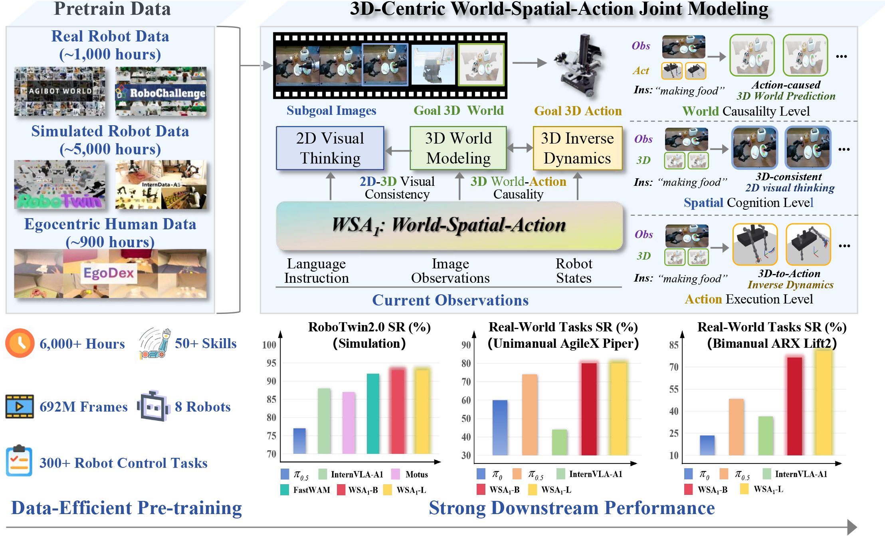
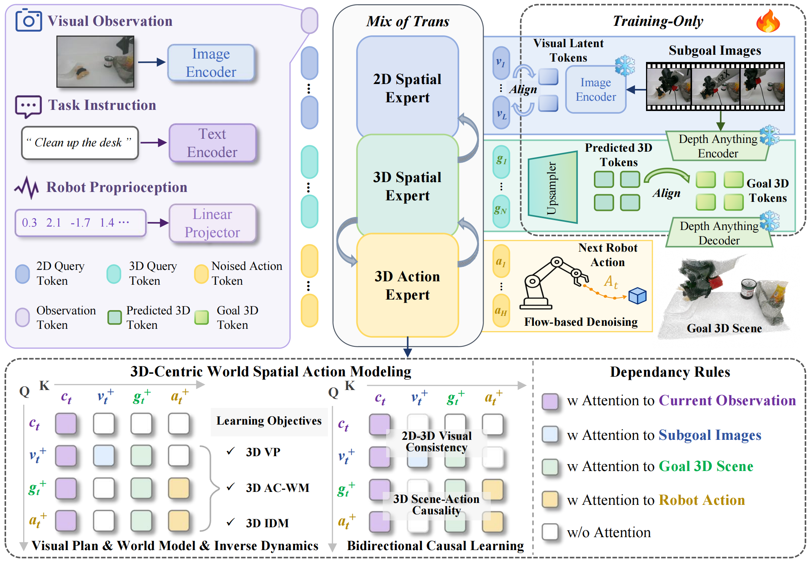

<h1 align="center">WSA: A 3D-Centric World-Spatial-Action Model<br>for Generalizable Robot Control</h1>

<p align="center">
  
</p>

<p align="center">
  An embodied foundation model that introduces <strong>World-Spatial-Action</strong> modeling
  to unify instruction-aligned 2D visual planning,
  action-conditioned 3D world modeling, and 3D-aware action generation.
</p>

<p align="center">
  <a href="https://zaleni.github.io/WSA1/"></a>
  <a href="https://github.com/zaleni/WSA"></a>
  <a href="https://arxiv.org/abs/2607.03941"></a>
  <a href="https://huggingface.co/collections/zaleni/wsa1"></a>
  <a href="https://robochallenge.ai/competition/cvpr"></a>
</p>

<br>

<p align="center">
  
</p>

<a id="news"></a>

## 🗞️ News

- [2026-07-06]: 🚀 Released **WSA-Large** code, weights, benchmark results, and
  training/evaluation workflows for the 6B Wan2.2-based WSA model.
- [2026-05-31]: 🎉 Released the WSA-Base training, evaluation, and inference code.
- [2026-05-31]: 🤗 Released the WSA-Base Hugging Face model collection, including
  Base, RoboTwin, and LIBERO checkpoints.
- [2026-05-18]: 🏆 **WSA ranked 4th out of 100+ teams on the [RoboChallenge CVPR 2026 leaderboard](https://robochallenge.ai/competition/cvpr)** with fully open-source weights and code. (Team: MagicBot)

<a id="todo-list"></a>

## TODO List

- [x] Provide RoboTwin, LIBERO, and real-world robot example inference workflows.
- [x] Release WSA policy code and fine-tuning scripts.
- [x] Release WSA pretraining scripts.
- [x] **Release the WSA-Large code for the 6B WSA model based on the Wan2.2 model backbone.**
- [x] **Release WSA-Large weights and benchmark results.**
- [x] Release the arXiv paper and citation.
- [ ] Provide the training and evaluation codes on **RoboChallenge2.0**.
- [ ] Release **WSA1.5**, our **next-generation foundation model**, pretrained on **larger and more diverse datasets** with **memory capabilities** for long-horizon robotic tasks.


## Table of Contents
- [Framework](#framework)
- [Repository Layout](#repository-layout)
- [Installation](#installation)
- [Model Zoo](#model-zoo)
- [Inference](#inference)
- [Training](#training)
  - [RoboTwin Fine-tuning](#robotwin-fine-tuning)
  - [Fine-tuning example](#fine-tuning-example)
  - [Multi-Dataset Pretraining](#multi-dataset-pretraining)
- [Acknowledgments](#acknowledgments)
- [Citation](#citation)

## Framework

<p align="center">
  
</p>

WSA is a **World-Spatial-Action (WSA)** embodied foundation model for
generalizable robot control. It learns a shared 2D-3D latent space that connects
instruction-aligned **visual planning**, action-conditioned **3D world prediction**,
and 3D-aware **action generation**.

### 🌟 Highlights:

- **Unified World-Spatial-Action Modeling:** WSA unifies semantic understanding, 3D world modeling, and physical
  execution.
- **Bidirectional 3D Causality:** WSA learns both action-conditioned scene dynamics and
  3D inverse dynamics.
- **Mixture-of-Transformers:** WSA coordinates 2D planning, 3D prediction, and 3D action
  generation with shared dependency rules.
- **Data-Efficient Pretraining:** Pretraining on 6,000 demonstration hours yields strong
  simulation and real-world manipulation performance.
- **Superior Performance:** State-of-the-art results across simulation
  and real-world robot manipulation tasks, achieved by our open-source model.

---
🤖 Result on RoboTwin 2.0 randomized setting, averaged over 50 simulated aloha manipulation tasks:
| Metric | π0 | π0.5 | ABot-M0 | Motus | InternVLA-A1 | LingBot-VA | Fast-WAM | **WSA-B** | **WSA-L** |
| --- | ---: | ---: | ---: | ---: | ---: | ---: | ---: | ---: | ---: |
| Avg. Success (Hard) | 58.40% | 76.76% | 85.08% | 87.02% | 89.64% | 91.50% | 91.78% | 92.70% | **93.14%** |

## Repository Layout

```text
assets/                  README figures and paper assets
configs/                 data sampling and weight-rule configs
evaluation/
  RoboTwin/              RoboTwin evaluation entrypoints
  Libero/                LIBERO evaluation and websocket serving helpers
  Real_Piper_Example/    Piper real-robot serving/client example
  Real_Lift2_Example/    Lift2 real-robot serving/client example
launch/
  wsa_base_*.sh          WSA-B pretraining and fine-tuning scripts
  wsa_large_*.sh         WSA-L pretraining and fine-tuning scripts
  supported_methods/     RoboTwin fine-tuning scripts for comparison methods
src/lerobot/             LeRobot-based training, dataset, and policy code
third_party/             Git submodules for external projects
tools/                   support scripts used by training workflows
```

## Installation

The main development environment uses Python 3.10, CUDA 12.8, and
PyTorch 2.7.1.

```bash
git clone https://github.com/zaleni/WSA.git
cd WSA

conda create -y -n wsa python=3.10
conda activate wsa

conda install -c conda-forge ffmpeg=7.1.1 svt-av1 -y

pip install torch==2.7.1 torchvision==0.22.1 torchaudio==2.7.1 \
  --index-url https://download.pytorch.org/whl/cu128

pip install torchcodec numpy scipy transformers==4.57.1 mediapy loguru pytest omegaconf h5py rich
pip install -e .
```

WSA uses a patched Qwen3-VL implementation for cached inference. After
installing `transformers==4.57.1`, copy the replacement model files into the
installed package:

```bash
TRANSFORMERS_DIR=${CONDA_PREFIX}/lib/python3.10/site-packages/transformers/
cp -r src/lerobot/policies/WSA_Base/transformers_replace/models ${TRANSFORMERS_DIR}
```

RoboTwin 2.0 and LIBERO evaluation also require their official codebases.
These dependencies are included as Git submodules under `third_party/`. To initialize them, run:
```bash
git submodule update --init --recursive
```
For real-robot serving and websocket evaluation:
```bash
pip install tyro matplotlib mediapy websockets msgpack
```

## Model Zoo

<table>
  <thead>
    <tr>
      <th>Name</th>
      <th>Type</th>
      <th>Usage</th>
    </tr>
  </thead>
  <tbody>
    <tr>
      <td colspan="3"><strong>WSA-Base (3B)</strong>     ~Backbone: <a href="https://huggingface.co/Qwen/Qwen3-VL-2B-Instruct">Qwen3-VL-2B</a></sub></td>
    </tr>
    <tr>
      <td><a href="https://huggingface.co/zaleni/WSA-Base">WSA-Base</a></td>
      <td>Pretrained policy</td>
      <td>WSA-Base pretrained model for downstream finetuning</td>
    </tr>
    <tr>
      <td><a href="https://huggingface.co/zaleni/WSA-Base-RoboTwin">WSA-Base RoboTwin</a></td>
      <td>RoboTwin finetuned model</td>
      <td>Fine-tuned from WSA-Base for RoboTwin evaluation and inference</td>
    </tr>
    <tr>
      <td><a href="https://huggingface.co/zaleni/WSA-Base-LIBERO">WSA-Base LIBERO</a></td>
      <td>LIBERO finetuned model</td>
      <td>Fine-tuned from WSA-Base for LIBERO evaluation and inference</td>
    </tr>
    <tr>
      <td colspan="3"><strong>WSA-Large (6B)</strong>   ~Backbone: <a href="https://huggingface.co/Wan-AI/Wan2.2-TI2V-5B">Wan2.2-TI2V-5B</a></td>
    </tr>
    <tr>
      <td><a href="https://huggingface.co/zaleni/WSA-Large">WSA-Large</a></td>
      <td>Pretrained policy</td>
      <td>WSA-Large pretrained model for downstream finetuning</td>
    </tr>
    <tr>
      <td><a href="https://huggingface.co/zaleni/WSA-Large-RoboTwin">WSA-Large RoboTwin</a></td>
      <td>RoboTwin finetuned model</td>
      <td>Fine-tuned from WSA-Large for RoboTwin evaluation and inference</td>
    </tr>
    <tr>
      <td><a href="https://huggingface.co/zaleni/WSA-Large-LIBERO">WSA-Large LIBERO</a></td>
      <td>LIBERO finetuned model</td>
      <td>Fine-tuned from WSA-Large for LIBERO evaluation and inference</td>
    </tr>
  </tbody>
</table>

All released models are available in the
[WSA Hugging Face collection](https://huggingface.co/collections/zaleni/wsa1).

For action evaluation with the released model, use
`DISABLE_DA3_TEACHER_FOR_EVAL=true`.

## Inference

- RoboTwin: [evaluation/RoboTwin/README.md](evaluation/RoboTwin/README.md)
- Real Piper example:
  [evaluation/Real_Piper_Example/README.md](evaluation/Real_Piper_Example/README.md)
- Real Lift2 example:
  [evaluation/Real_Lift2_Example/README.md](evaluation/Real_Lift2_Example/README.md)

The real-robot examples split inference into a GPU policy server and a
robot-side client. They are intended as reference integrations that can be
adapted to your own hardware. The released checkpoints were evaluated on `NVIDIA GeForce RTX 4090 GPUs`.

## Training

All WSA training scripts are under `launch/`.
For fine-tuning, initialize from the released base pretrained checkpoint with
`POLICY_INIT_PATH=zaleni/WSA-Base`.
Training used `8x NVIDIA H200 GPUs`.

### RoboTwin Fine-tuning

`launch/wsa_base_finetune_robotwin.sh` discovers all LeRobot-v3 datasets under
`ROBOTWIN_ROOT` and trains on them as a multi-dataset run.

Download the RoboTwin LeRobot-v3.0 dataset from Hugging Face and point
`ROBOTWIN_ROOT` to the local download directory:

```bash
hf download hxma/RoboTwin-LeRobot-v3.0 \
  --repo-type dataset \
  --local-dir /path/to/robotwin_lerobot_v3.0
```

Compute external normalization statistics before training. The output path below
matches the `DATASET_EXTERNAL_STATS_ROOT=/path/to/norm_stats` layout used by the
training script:

```bash
ROBOTWIN_ROOT=/path/to/robotwin_lerobot_v3.0

find -L "${ROBOTWIN_ROOT}" -path "*/meta/info.json" -print \
  | while read -r info; do dirname "$(dirname "$info")"; done \
  | sort -u > robotwin_repo_ids.txt

python tools/compute_norm_stats_multi.py \
  --repo_id_file robotwin_repo_ids.txt \
  --action_mode delta \
  --chunk_size 50 \
  --num_workers 8 \
  --output_path /path/to/norm_stats/aloha/delta/stats.json
```

If you want to train with `ACTION_TYPE=abs`, compute stats with `--action_mode abs` and write to
`/path/to/norm_stats/aloha/abs/stats.json` instead.

```bash
POLICY_INIT_PATH=zaleni/WSA-Base \
ROBOTWIN_ROOT=/path/to/robotwin_lerobot_v3.0 \
ACTION_TYPE=delta \
USE_EXTERNAL_STATS=true \
DATASET_EXTERNAL_STATS_ROOT=/path/to/norm_stats \
bash launch/wsa_base_finetune_robotwin.sh
```

### Fine-tuning example

Use this script for a single LeRobot-v3.0 dataset. It defaults to delta actions.

```bash
POLICY_INIT_PATH=zaleni/WSA-Base \
DATASET_REPO_ID=/path/to/lerobot_v3.0_dataset \
ACTION_TYPE=delta \
USE_EXTERNAL_STATS=true \
bash launch/wsa_base_finetune.sh
```

For delta-action training, compute normalization statistics first:

```bash
python tools/compute_norm_stats_single.py \
  --repo_id /path/to/lerobot_v3.0_dataset \
  --action_mode delta \
  --chunk_size 50 \
  --output_dir norm_stats
```

### Multi-Dataset Pretraining

`launch/wsa_base_pretrain.sh` can discover datasets from multiple roots:
`INTERNDATA_ROOT`, `ROBOTWIN_ROOT`, `ROBOCHALLENGE_ROOT`, `AGIBOT_ROOT`, and
`EGODEX_LEROBOT_ROOT`.

```bash
ROBOTWIN_ROOT=/path/to/robotwin_lerobot_v3 \
EGODEX_LEROBOT_ROOT=/path/to/egodex_lerobot_v3 \
DATASET_EXTERNAL_STATS_ROOT=/path/to/norm_stats \
WEIGHT_RULES_PATH=configs/weight_rules_wsa_base_pretrain.yaml \
bash launch/wsa_base_pretrain.sh
```

For WSA-Large multi-dataset pretraining, prepare per-embodiment stats and use
the WSA-Large launch script:

```bash
bash tools/wsa_large_compute_pretrain_norm_stats.sh

DATASET_EXTERNAL_STATS_ROOT=/path/to/norm_stats \
WEIGHT_RULES_PATH=configs/weight_rules_wsa_large_pretrain.yaml \
bash launch/wsa_large_pretrain.sh
```

Some other policies are also supported by this repository, training scripts are available in
`launch/supported_methods/`:

- `qwenaction_finetune.sh`
- `pi0_finetune.sh`
- `pi05_finetune.sh`
- `internvla_a1_3b_finetune.sh`
- `fastwam_finetune.sh`


## Acknowledgments

WSA builds on the excellent work of the
[LeRobot](https://github.com/huggingface/lerobot),
[RoboTwin](https://github.com/RoboTwin-Platform/RoboTwin),
[Qwen3-VL](https://github.com/QwenLM/Qwen3-VL),
[Depth-Anything-3](https://github.com/ByteDance-Seed/Depth-Anything-3),
[InternVLA-A1](https://github.com/InternRobotics/InternVLA-A1), and
[FastWAM](https://github.com/yuantianyuan01/FastWAM). Some adapted policy scripts are kept in this repository to make reproduction and
ablation runs easier from the same codebase.

## Citation

If you find WSA useful in your research, please cite our [paper](https://arxiv.org/abs/2607.03941):

```bibtex
@article{jiang2026wsa1,
  title         = {{WSA}$_1$: a 3D-Centric World-Spatial-Action Model for Generalizable Robot Control},
  author        = {Jiang, Jiahao and Zhang, Jianing and Yin, Zhenhan and Chen, Ruidong and Wang, Sen and Yu, Zhaoshu and Zeng, Pengpeng and Cao, Xiaofeng and Wang, Xuanhan and Song, Jingkuan and Shen, Heng Tao},
  journal       = {arXiv preprint arXiv:2607.03941},
  year          = {2026},
  doi           = {10.48550/arXiv.2607.03941},
  url           = {https://arxiv.org/abs/2607.03941}
}
```

<p align="center">
  
  &nbsp;&nbsp;&nbsp;&nbsp;
  
</p>
