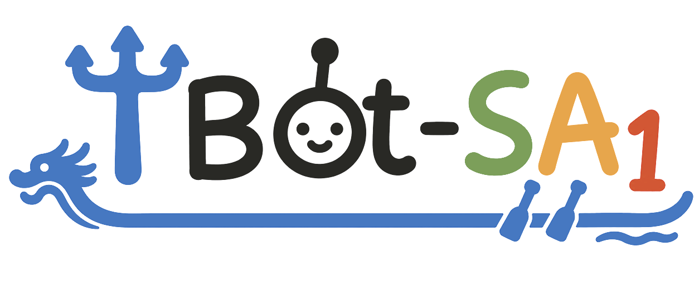

<h1 align="center">WSA: a 3D-Causal World-Spatial-Action Model<br>for Generalizable Robot Control</h1>

<p align="center">
  
</p>

<p align="center">
  a <strong>World-Spatial-Action</strong> embodied
  foundation model that unifies instruction-aligned 2D visual planning,
  action-conditioned 3D world modeling, and 3D-aware action generation.
</p>

<p align="center">
  <a href="https://zaleni.github.io/WSA/"></a>
  <a href="https://github.com/zaleni/WSA"></a>
  <a href="https://zaleni.github.io/WSA/assets/paper/manuscript.pdf"></a>
  <a href="https://huggingface.co/collections/zaleni/wsa"></a>
  <a href="https://robochallenge.ai/competition/cvpr"></a>
</p>

<br>

<p align="center">
  
</p>

<a id="news"></a>

## 🗞️ News

- [2026-05-18]: 🏆 Our fully open-source WSA model **WSA ranked 4th/100+ teams on the [RoboChallenge CVPR 2026 leaderboard](https://robochallenge.ai/competition/cvpr).** (Team: MagicBot)
- [2026-05-31]: 🎉 Release of WSA training, evaluation, and inference code.
- [2026-05-31]: 🤗 Released the WSA paper and the WSA Hugging Face
  model collection with Base, RoboTwin, and LIBERO models.

<a id="todo-list"></a>

## TODO List

- [x] Provide RoboTwin, LIBERO, and real world robot example inference workflows.
- [x] Release WSA policy code and finetuning scripts.
- [x] Release WSA pretraining scripts.
- [ ] Release paper on arxiv and citation.
- [ ] Release results and models on more benchmarks.
- [ ] **[Coming soon] Release WSA Large model code, a 6B WSA model using Wan2.2 video model as backbone.**
- [ ] **Release WSA Large model weights and results.**

## Table of Contents
- [Framework](#framework)
- [Repository Layout](#repository-layout)
- [Installation](#installation)
- [Model Zoo](#model-zoo)
- [Inference](#inference)
- [Training](#training)
  - [RoboTwin Finetuning](#robotwin-finetuning)
  - [Finetuning example](#finetuning-example)
  - [Multi-Dataset Pretraining](#multi-dataset-pretraining)
- [Acknowledgments](#acknowledgments)
- [Citation](#citation)

## Framework

<p align="center">
  
</p>

WSA is a **World-Spatial-Action (WSA)** embodied foundation model for
generalizable robot control. It learns a shared 2D-3D latent space that connects
instruction-aligned **visual planning**, action-conditioned **3D world prediction**,
and 3D-aware **action generation**.

### 🌟 Highlights:

- **Unified WSA Modeling:** WSA modeling unifies semantic understanding, 3D world modeling, and physical
  execution.
- **Bidirectional 3D Causality:** Bidirectional 3D causality learns both action-conditioned scene dynamics and
  3D inverse dynamics.
- **Mixture-of-Transformers:** Mixture-of-Transformers coordinates 2D planning, 3D prediction, and 3D action
  generation with shared dependency rules.
- **Data-Efficient Pretraining:** Data-efficient pretraining on 6,000 demonstration hours yields strong
  simulation and real-world manipulation performance.
- **Superior Performance:** State-of-the-art results across simulation
  and real-world robot manipulation tasks, achieved by our open-source model.

---
🤖 Result on RoboTwin 2.0 randomized setting, averaged over 50 simulated aloha manipulation tasks:
| Metric | π0 | π0.5 | ABot-M0 | Motus | InternVLA-A1 | LingBot-VA | Fast-WAM | **WSA** |
| --- | ---: | ---: | ---: | ---: | ---: | ---: | ---: | ---: |
| Avg. Success (Hard) | 58.40% | 76.76% | 85.08% | 87.02% | 89.64% | 91.50% | 91.78% | **92.70%** |

## Repository Layout

```text
assets/                  README figures and paper assets
configs/                 data sampling and weight-rule configs
evaluation/
  RoboTwin/              RoboTwin evaluation entrypoints
  Libero/                LIBERO evaluation and websocket serving helpers
  Real_Piper_Example/    Piper real-robot serving/client example
  Real_Lift2_Example/    Lift2 real-robot serving/client example
launch/
  wsa_base_*.sh          WSA pretraining and finetuning scripts
  supported_methods/     RoboTwin finetuning scripts for comparison methods
src/lerobot/             LeRobot-based training, dataset, and policy code
third_party/             Git submodules for external projects
tools/                   support scripts used by training workflows
```

## Installation

The main development environment uses Python 3.10, CUDA 12.8, and
PyTorch 2.7.1.

```bash
git clone https://github.com/zaleni/WSA.git
cd WSA

conda create -y -n wsa_base python=3.10
conda activate wsa_base

conda install -c conda-forge ffmpeg=7.1.1 svt-av1 -y

pip install torch==2.7.1 torchvision==0.22.1 torchaudio==2.7.1 \
  --index-url https://download.pytorch.org/whl/cu128

pip install torchcodec numpy scipy transformers==4.57.1 mediapy loguru pytest omegaconf h5py rich
pip install -e .
```

WSA uses a patched Qwen3-VL implementation for cached inference. After
installing `transformers==4.57.1`, copy the replacement model files into the
installed package:

```bash
TRANSFORMERS_DIR=${CONDA_PREFIX}/lib/python3.10/site-packages/transformers/
cp -r src/lerobot/policies/WSA_Base/transformers_replace/models ${TRANSFORMERS_DIR}
```

Evaluation in the RoboTwin 2.0 and LIBERO additionally requires their official codebases. These dependencies are included as Git submodules under `third_party/`. To initialize them, run:
```bash
git submodule update --init --recursive
```
For real-robot serving and websocket evaluation:
```bash
pip install tyro matplotlib mediapy websockets msgpack
```

## Model Zoo

| Name | Type | Usage |
| --- | --- | --- |
| [WSA Base](https://huggingface.co/zaleni/WSA-Base) | Pretrained policy | WSA Base pretrained model for downstream finetuning |
| [WSA Base RoboTwin](https://huggingface.co/zaleni/WSA-RoboTwin) | RoboTwin finetuned model | Fine-tuned from WSA Base for RoboTwin evaluation and inference |
| [WSA Base LIBERO](https://huggingface.co/zaleni/WSA-LIBERO) | LIBERO finetuned model | Fine-tuned from WSA Base for LIBERO evaluation and inference |

All released models are available in the
[WSA Hugging Face collection](https://huggingface.co/collections/zaleni/wsa).

For action evaluation with the released model, use
`DISABLE_DA3_TEACHER_FOR_EVAL=true`.

## Inference

- RoboTwin: [evaluation/RoboTwin/README.md](evaluation/RoboTwin/README.md)
- Real Piper example:
  [evaluation/Real_Piper_Example/README.md](evaluation/Real_Piper_Example/README.md)
- Real Lift2 example:
  [evaluation/Real_Lift2_Example/README.md](evaluation/Real_Lift2_Example/README.md)

The real-robot examples split inference into a GPU policy server and a
robot-side client. They are intended as reference integrations that you can
adapt to your own hardware. Our evaluation results were conducted on `NVIDIA GeForce RTX 4090 GPUs`.

## Training

All WSA training scripts live directly under `launch/`.
For finetuning, initialize from the released base pretrained model with
`POLICY_INIT_PATH=zaleni/WSA-Base`.
We trained models on `8 × NVIDIA H200 GPUs`.

### RoboTwin Finetuning

`launch/wsa_base_finetune_robotwin.sh` discovers all LeRobot-v3 datasets under
`ROBOTWIN_ROOT` and trains over them as a multi-dataset run.

Download the RoboTwin LeRobot-v3.0 dataset from Hugging Face and point
`ROBOTWIN_ROOT` to the local download directory:

```bash
hf download hxma/RoboTwin-LeRobot-v3.0 \
  --repo-type dataset \
  --local-dir /path/to/robotwin_lerobot_v3.0
```

Compute external normalization statistics before training. The output path below
matches the `DATASET_EXTERNAL_STATS_ROOT=/path/to/norm_stats` layout used by the
training script:

```bash
ROBOTWIN_ROOT=/path/to/robotwin_lerobot_v3.0

find -L "${ROBOTWIN_ROOT}" -path "*/meta/info.json" -print \
  | while read -r info; do dirname "$(dirname "$info")"; done \
  | sort -u > robotwin_repo_ids.txt

python tools/compute_norm_stats_multi.py \
  --repo_id_file robotwin_repo_ids.txt \
  --action_mode delta \
  --chunk_size 50 \
  --num_workers 8 \
  --output_path /path/to/norm_stats/aloha/delta/stats.json
```

If you want to train with `ACTION_TYPE=abs`, compute stats with `--action_mode abs` and write to
`/path/to/norm_stats/aloha/abs/stats.json` instead.

```bash
POLICY_INIT_PATH=zaleni/WSA-Base \
ROBOTWIN_ROOT=/path/to/robotwin_lerobot_v3.0 \
ACTION_TYPE=delta \
USE_EXTERNAL_STATS=true \
DATASET_EXTERNAL_STATS_ROOT=/path/to/norm_stats \
bash launch/wsa_base_finetune_robotwin.sh
```

### Finetuning example

Use this script for a single LeRobot-v3.0 dataset. It defaults to delta actions.

```bash
POLICY_INIT_PATH=zaleni/WSA-Base \
DATASET_REPO_ID=/path/to/lerobot_v3.0_dataset \
ACTION_TYPE=delta \
USE_EXTERNAL_STATS=true \
bash launch/wsa_base_finetune.sh
```

For delta-action training, compute normalization statistics first:

```bash
python tools/compute_norm_stats_single.py \
  --repo_id /path/to/lerobot_v3.0_dataset \
  --action_mode delta \
  --chunk_size 50 \
  --output_dir norm_stats
```

### Multi-Dataset Pretraining

`launch/wsa_base_pretrain.sh` can discover datasets from multiple roots:
`INTERNDATA_ROOT`, `ROBOTWIN_ROOT`, `ROBOCHALLENGE_ROOT`, `AGIBOT_ROOT`, and
`EGODEX_LEROBOT_ROOT`.

```bash
ROBOTWIN_ROOT=/path/to/robotwin_lerobot_v3 \
EGODEX_LEROBOT_ROOT=/path/to/egodex_lerobot_v3 \
DATASET_EXTERNAL_STATS_ROOT=/path/to/norm_stats \
WEIGHT_RULES_PATH=configs/wsa_base_pretrain_data_config.yaml \
bash launch/wsa_base_pretrain.sh
```

Some other policies are also supported by this repository, training scripts are available in
`launch/supported_methods/`:

- `qwenaction_finetune.sh`
- `pi0_finetune.sh`
- `pi05_finetune.sh`
- `internvla_a1_3b_finetune.sh`
- `fastwam_finetune.sh`


## Acknowledgments

WSA builds on the excellent work of the
[LeRobot](https://github.com/huggingface/lerobot),
[RoboTwin](https://github.com/RoboTwin-Platform/RoboTwin),
[Qwen3-VL](https://github.com/QwenLM/Qwen3-VL),
[Depth-Anything-3](https://github.com/ByteDance-Seed/Depth-Anything-3),
[InternVLA-A1](https://github.com/InternRobotics/InternVLA-A1), and
[FastWAM](https://github.com/yuantianyuan01/FastWAM). Some adapted policy scripts are kept in this repository to make reproduction and
ablation runs easier from the same codebase.

## Citation
Coming Soon.
<p align="center">
  
  &nbsp;&nbsp;&nbsp;&nbsp;
  
</p>
